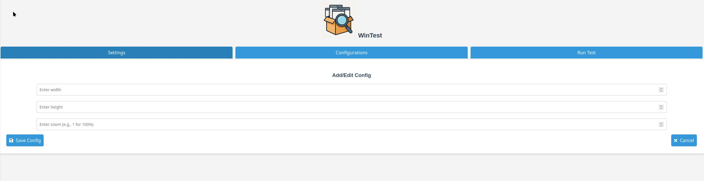
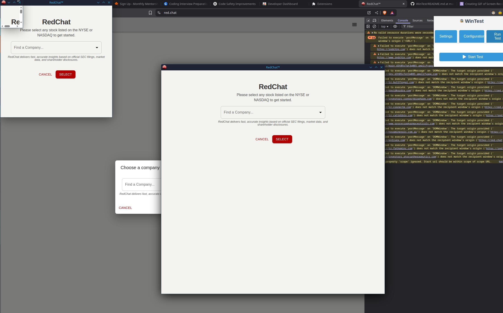

# WinTest

**WinTest** is a Chrome extension built for web developers who want to see how their website looks across a variety of screen sizes and zoom levels — instantly.

### 🚀 What It Does

- Save and manage custom screen size + zoom presets
- One-click launch to open multiple windows at different dimensions
- Automatically applies zoom so you see exactly what users might
- Great for responsive testing, UI polish, or browser presentation previews

---



### 💡 Why Use It?

> Want to see your site at `1000×1000` with `zoom: 0.8`?  
> Or 50 windows all at different breakpoints?  
> That's what **WinTest** is for.

No messing around with dev tools emulators or resizing your browser manually — just punch in your sizes and launch.

---

### 🧩 Features

- ✅ Add/Edit/Delete screen configs
- ✅ Zoom level control (per config)
- ✅ Quick launch for all saved configs
- ✅ Simple, clean UI for managing everything
- ✅ Error recovery and validation built-in

---

### 🛠️ Setup

1. Clone this repo
2. Open Chrome > `chrome://extensions`
3. Enable **Developer mode**
4. Click **Load unpacked**
5. Select the `/extension` folder

---

### 🔨 Build for Release

Use the provided build script to package your extension for upload:

```bash
npm install
npm run build
