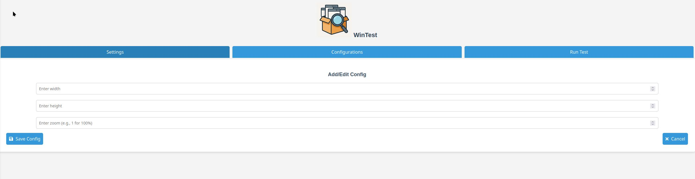
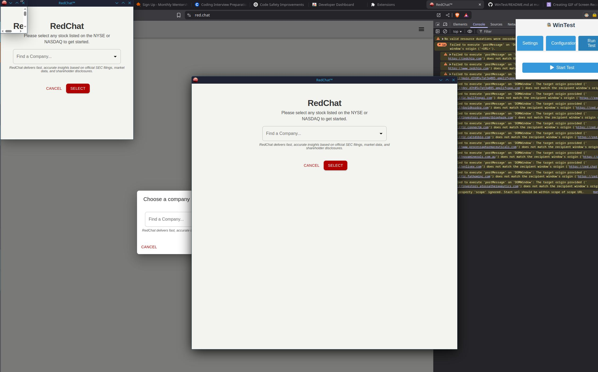

# WinTest

**WinTest** is a Chrome extension for previewing a page across many screen sizes and externally verifying those layouts with full-resolution screenshots from Cloudflare Browser Run.



### 🚀 What It Does

- Save and manage custom viewport size + zoom presets
- Launch every saved configuration in one click, each in its own window
- Applies zoom **per tab**, so several sizes of the same site keep their own zoom
- Corrects for browser chrome, so a 414×896 config gives a real 414×896 CSS viewport
- Captures an exact remote viewport from an **External verify** button
- Opens every external capture in a dedicated viewer with fit-to-window and natural 1:1 pixel modes
- Controls device-pixel ratio (DPR), so CSS size and PNG pixel size are explicit
- Optionally POSTs the captured PNG to a customer webhook
- Records issues you spot against the configuration you spotted them in

---



### 💡 Why Use It?

> Want to see your site at `1000×1000` with `zoom: 0.8`?
> Or every breakpoint at once, side by side?

No wrestling with dev tools emulators or resizing windows by hand — enter your sizes and launch.

---

### 🧩 Features

- ✅ Add / edit / delete viewport configs
- ✅ Per-config zoom, applied with per-tab scope
- ✅ True viewport sizing (window frame compensated automatically)
- ✅ Quick launch for all saved configs
- ✅ Launching runs in the background service worker, so closing the popup mid-batch doesn't cancel the run or lose track of open windows
- ✅ "Close all" works even after the popup has been reopened
- ✅ Issue log per configuration
- ✅ Error recovery and validation built in
- ✅ Ultrawide (`3440×1440`) and 4K (`3840×2160`) presets
- ✅ Authenticated Cloudflare Worker with public-URL validation and bounded output
- ✅ Full-resolution PNG preview/download plus customer webhook delivery status

### 🔍 About viewport sizes

Chrome's window width and height **include the browser frame**, so asking for a
900px-tall window historically gave roughly an 820px-tall page. WinTest measures
the real CSS viewport after the page loads and resizes the window to compensate,
then reports the measured result in the status list. If the display is too small
to fit the requested size, the status line shows what was actually achieved
instead of silently reporting success.

There are two separate measurements:

| Setting | Meaning |
| --- | --- |
| CSS viewport | The layout area reported to the page by `window.innerWidth` and `window.innerHeight` |
| DPR | The number of PNG pixels produced for each CSS pixel |

For example, a `3440×1440` viewport at DPR `1` produces a real
`3440×1440` PNG. A `390×844` viewport at DPR `3` produces a
`1170×2532` PNG while the responsive layout still sees `390×844` CSS pixels.
WinTest supports viewports from 100 to 7680 CSS pixels per axis and limits the
final output to 7680 pixels per axis.

This verifies browser layout and raster output at the requested dimensions. It
cannot reproduce physical monitor inches, panel technology, color calibration,
operating-system scaling, or the viewer's actual hardware.

### 🔐 Permissions

| Permission | Why |
| --- | --- |
| `tabs` | Read the active tab's URL to prefill the test field, and apply zoom |
| `scripting` | Measure the real CSS viewport inside test windows it opened |
| `storage` | Track open test windows across popup sessions |
| `activeTab` | Temporary access to the invoking tab |
| Optional verifier origin | Contact WinTest's screenshot service after the user enables external verification |

The verifier permission is optional and limited to WinTest's single deployed
Worker origin. It does not require broad website access at install time.

---

### 🛠️ Setup

1. Clone this repo
2. Open Chrome > `chrome://extensions`
3. Enable **Developer mode**
4. Click **Load unpacked**
5. Select this project folder (the one with `manifest.json`)

### ☁️ External verification

External verification is included for every WinTest user. There is no account,
Worker URL, or shared token to configure:

1. Enter the target page in **Run Test**.
2. Optionally save an HTTPS customer webhook and its bearer token.
3. Open **Configurations** and click **External verify**.
4. Approve access to WinTest's verifier the first time Chrome asks.

The service gives each extension installation an anonymous identifier and
allows six verification requests per minute. It contains no user identity or
browsing data and is used only for fair-use limiting.

The `cloudflare/` directory contains the app-owned Worker. Maintainers can
deploy it with:

```bash
cd cloudflare
npm install
npx wrangler login
npm run deploy
```

All users share the Cloudflare account's Browser Run allowance. Cloudflare's
Free plan currently includes 10 browser minutes per day and limits Quick Actions
to one request every 10 seconds. A public launch may therefore require the
Workers Paid plan as usage grows. See the current [Browser Run limits](https://developers.cloudflare.com/browser-run/limits/)
and [pricing](https://developers.cloudflare.com/browser-run/pricing/).

### Webhook contract

When configured, the Worker sends:

- `POST` with the raw PNG as the request body
- `Content-Type: image/png`
- `Authorization: Bearer <webhook token>` when a webhook token is supplied
- `X-WinTest-Verification-Id`, capture time, label, target URL, CSS viewport,
  zoom, DPR, and output width/height metadata headers

The label and target URL header values are percent-encoded. A non-2xx webhook
response is reported in the extension, but the captured PNG is still returned
for preview and download.

Discord webhook URLs are detected automatically. WinTest uploads the screenshot
as a Discord file attachment with viewport details; leave the webhook bearer
token blank. The target URL remains the public webpage being captured—not the
Discord webhook. Localhost and private-network pages must first be exposed with
a public preview deployment or tunnel.

---

### 🧪 Tests

```bash
npm install
npm test
npm run test:worker
```

The extension suite covers per-tab zoom, viewport compensation, window tracking,
URL validation, and CSS-to-output pixel conversion.
The Worker suite covers anonymous rate limiting, target/webhook validation, Browser Run
parameters, binary webhook delivery, output limits, and failure behavior.

---

### 🔨 Build for Release

Package the extension for upload to the Chrome Web Store:

```bash
npm install
npm run build
```

This writes `dist/extension.zip` containing only the runtime files —
`manifest.json` at the archive root, the popup, the service worker, styles, and
resized icons. Screenshots, build scripts and `node_modules` are excluded.
